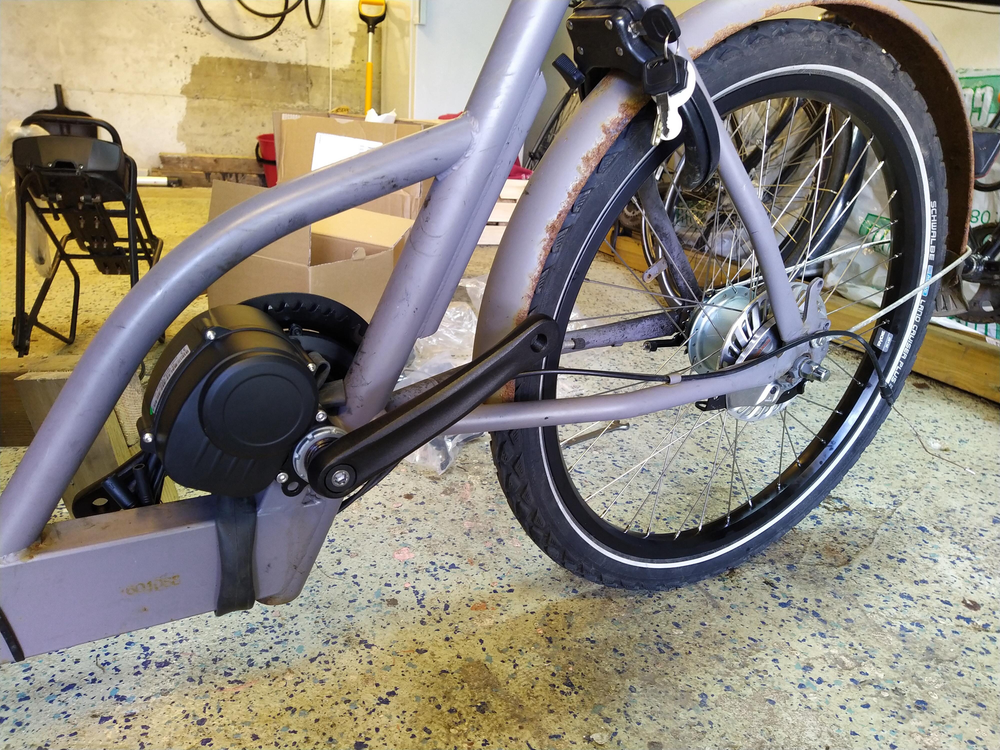

# Introduction
Since 2016, we've had a cargo bike of the swedish brand [cargobike](http://cargobike.se), named
[cargobike classic electric](https://www.cargobike.se/produkt/cargobike-classic-electric-hydraulic/) (the
link is for a newer version of the same bike). We use it all year long, for grocery shopping and lots
of other errands. After 6 years of briny winters, the bike is in a grave need of refurbishing.

In particular, the electric motor in the rear wheel broke this spring, so I started looking for a
replacement. I'm not very happy about the hub motor, which is too weak for the heavy bike, and
also has a very crude on-off style assistance. So I figured it would be better to get a mid drive
motor instead, either a Bafang BBS02 or Tongsheng TSDZ2.

# Investigating motor fit
The cargobike doesn't look quite like a normal bicycle, so it was clear that the mid motor
wouldn't fit under the frame like on a normal bike. However, there is a lot of space above,
so I figured it would be possible to mount it upside down.

But would it fit? I started googling, but couldn't find anyone who did the same conversion. For
reference, these are some of the searches I tried:

* cargobike classic bafang
* cargobike classic tsdz2
* babboe bafang (similar sort of cargo bike)

so in the end I just measured the space and ordered a Tongsheng TSDZ2 in the hope that it
would work fine.

# Other improvements
Apart from the broken motor, the casette, chain ring and chain was also due for replacement.
To cope with winter, I'd prefer internal gearing and a sealed breaking system instead of the mechanical
disc brakes it currently has. So I ordered a custom-built wheel with a Shimano Nexus 8 speed hub for roller brakes from
[Ginko veloteile](https://shop.ginkgo-veloteile.de) (highly recommended!), as well as roller brakes,
and front and rear lights.

I've also got front wheels for roller brakes, but those are not installed yet.

# Performing the conversion
Having stripped down the bike, it was clear that space isn't an issue. I was able to mount the
TSDZ2 upside down just as I had imagined. The only issue was with securing the motor from turning,
which is normally done by fastening it to the chain stay. This is not possible due to the frame
construction, so I resorted to securing it with a metal band ("hålband", protected in an old inner
tube). It's not perfect, but seems to work well enough.

The bottom bracket is 68mm, so I had to use both gaskets to fit it. It's still possible to wiggle
the motor a bit, so probably an additional spacer should be added "at some time".

I reused the old 36v battery that came with the bike. It has a pretty low capacity by now, but
for the short rides we typically use the bike for it's no problem.

# Verdict
Apart from the wiggle, the problems were mainly with stripping the bicycle down, with very stubborn
pedals. Being a relative newbie, adjusting the roller brakes and nexus 8 speed gears has also been a
challenge.

The new motor is much more powerful than the old one, which was one of my motivations for changing.
Being able to use it as a moped is also nice. Both front and rear lights are powered via the TSDZ2,
which is very neat. The cable was too short though, so I had to extend it to reach the front. Both
lamps are also mounted clumsily, but utility goes before beauty!

Hopefully this should work better for winters than the old motor/casette/brakes, but I guess that
will be clear after a few years!
